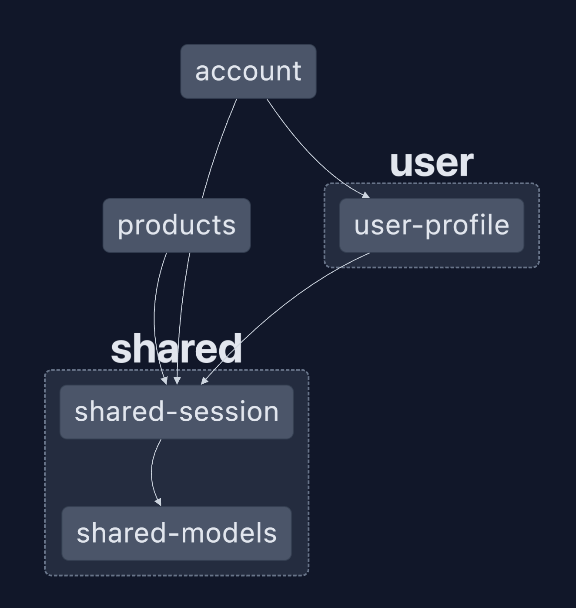

# Micro Frontend using Mono Repo with NX + Angular + Nginx

## Init

```shell
nvm use
cp example.env .env
pnpm install
```

## Start the application in development mode

```shell
pnpm dev [account]
```

## Explore the project

```shell
npx nx show project [account] --web
```

> You can also check the graph using `npx nx graph`, and next doing click on **Show all projects**



## Docker Compose

### UP

```shell
docker compose up
pnpm run d:u
```

### DOWN

```shell
docker compose donw
pnpm run dc:d
```

### UP WITH REBUILD

```shell
docker compose up --build
pnpm run dc:u:b
```

## Running tasks

### Create app

```shell
npx nx g @nx/angular:application [app]
```

### Genetate JS Library

```shell
npx npx nx g @nx/js:lib name --directory [shared|other-group-folder] [--tags shared] [--dry-run]
```

### Genetate Angualar Library

```shell
npx npx nx g @nx/angular:library name --directory=[shared|other-group-folder] [--tags shared] [--dry-run]
```

### Run test

```shell
pnpm run lint test --project=[app-name|lib-name]
```

### Run lint

```shell
pnpm run lint --project=[app-name|lib-name]
```

### Build for production

Run `NG_APP_TENANT=$TENANT nx run $APP:build --configuration=$ENV --base-href $BASE_HREF` to build the application.

## Resources

* Git: https://github.com/prebolledo/company-ng-mono-repo.git
* PNPM: https://pnpm.io/
* NVM: https://github.com/nvm-sh/nvm
* Angular: https://nx.dev/nx-api/angular
* NX: https://nx.dev/getting-started/intro
* Nginx: https://www.nginx.com/
* Docker: https://docs.docker.com/guides/
* Docker Compose: https://docs.docker.com/compose/
* Vercel: https://vercel.com/
  * https://company-ng-mono-repo.vercel.app/login
